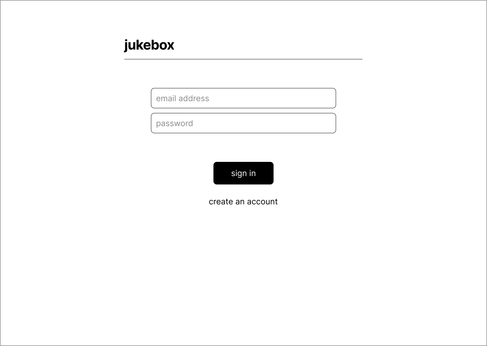
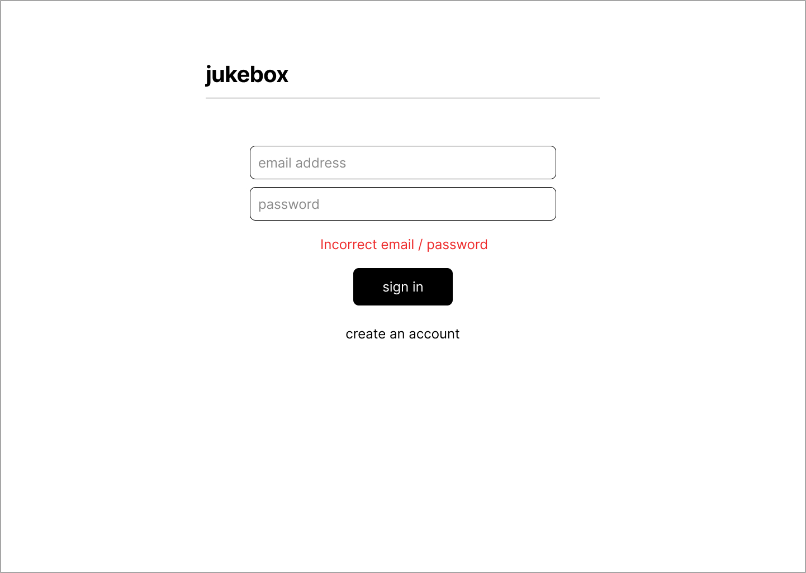
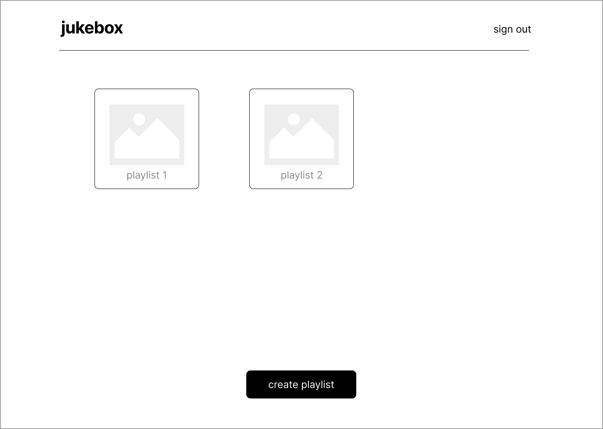
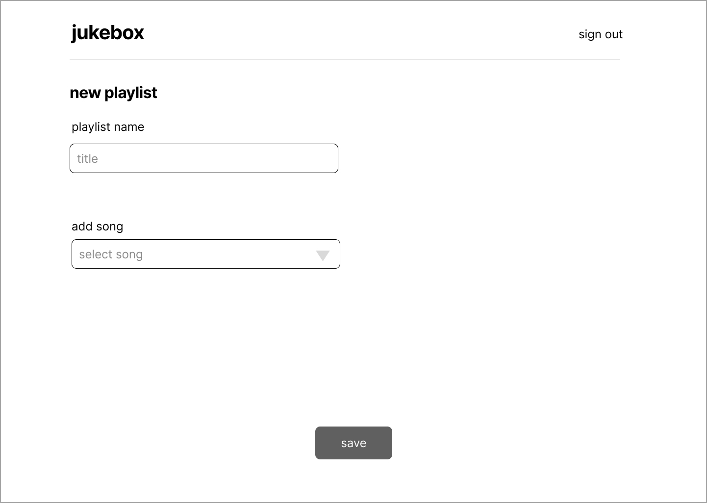
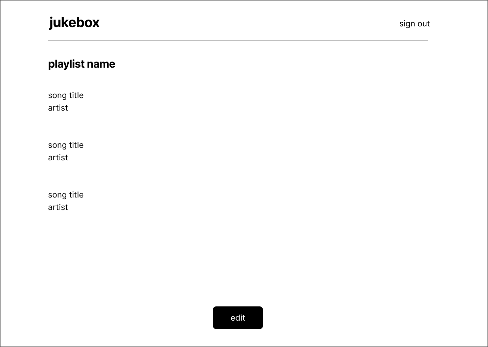
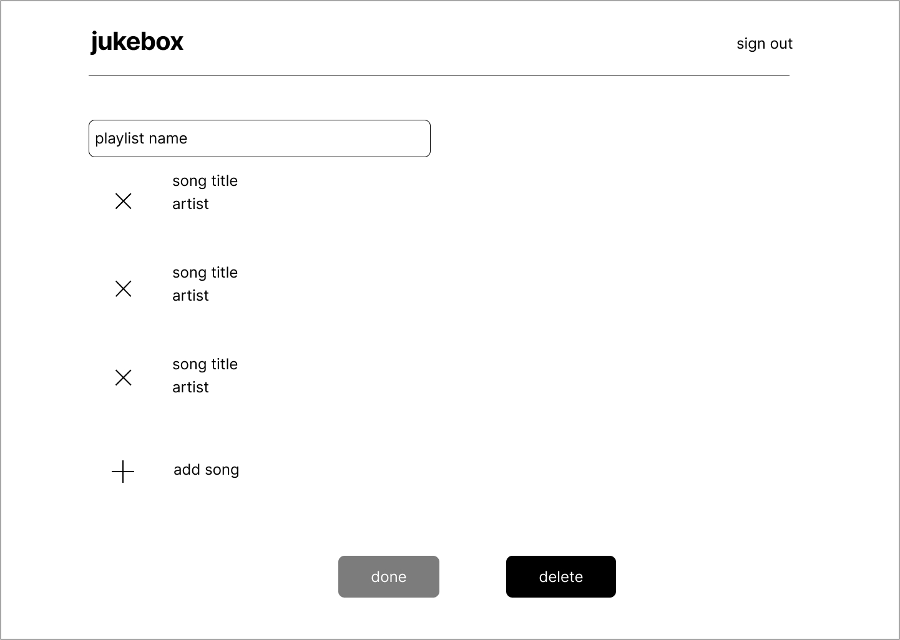
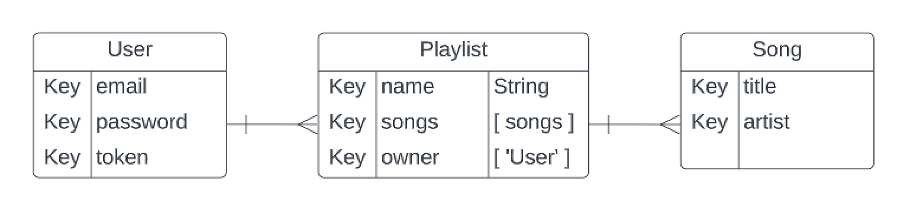

# Jukebox
Queue up your favorite songs in a playlist :musical_note:

## User stories
### MVP
- As a user, I want to create an account.
- As a user, I want to login.
- As a user, I want to know if my credentials are incorrect.
- As a user, I want to create a playlist.
- As a user, I want to add songs to my playlist.
- As a user, I want to view my created playlists.
- As a user, I want to view a selected playlist.
- As a user, I want to edit a single playlist.
- As a user, I want to delete songs from a selected playlist, or delete the whole playlist.

### Version 2
- As a user, I want to view and favorite others playlists.
- As a user, I want to play the selected song.
- As a user, I want to delete my account.

### Version 3
- As a user, I want to link this to my Spotify account.
- As a user, I want to make my playlist private or public.
- As a user, I want to "insert" a coin to play a random song.

## Wireframes
<figure>
    <figcaption>Login</figcaption>
    
</figure>
<figure>
    <figcaption>Incorrect login</figcaption>
    
</figure>
<figure>
    <figcaption>Index page</figcaption>
    
</figure>
<figure>
    <figcaption>Add playlist</figcaption>
    
</figure>
<figure>
    <figcaption>View single playlist</figcaption>
    
</figure>
<figure>
    <figcaption>Update or delete playlist</figcaption>
    
</figure>

## Entity Relationship Diagram (ERD)
<figure>
    <figcaption></figcaption>
    
</figure>

## Technologies used
- MongoDB
- Mongoose
- Node
- Express
- Bootstrap

## Routes Table: ##
| Name        | Path                             |HTTP Verb    |Purpose             |
| ----------- | -------------------------------- | ----------- | ------------------ |
| Index       | /playlists/                      |GET          |Display all playlists belonging to the user|
| Create      | /playlists/                      |POST         |Creates new playlist                       |
| Show        | /playlists/:playlistId           |GET          |Displays one playlist                      |
| Update      | /playlists/:playlistId           |PATCH        |Updates selected playlist                  |
| Delete      | /playlists/:playlistId           |DELETE       |Deletes playlist                           |
| Delete      | /songs/:songId                   |DELETE       |Deletes song from playlist                 |
| Create      | /songs/:songId                   |POST         |Adds new song to playlist                  |
| SignUp      | /sign-up                         |POST         |Creates new user account                   |
| SignIn      | /login                           |POST         |Logs user in                               |

---

Check out jukebox-client [here](https://github.com/hannaner/jukebox-client)